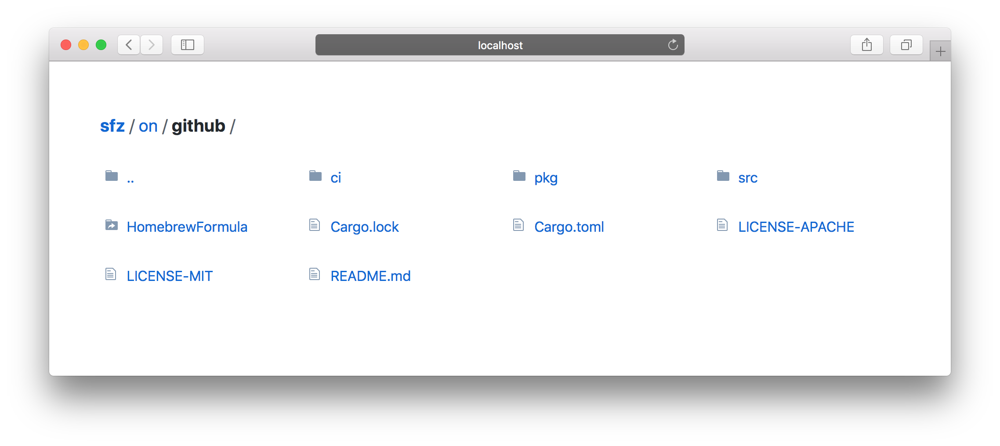

# [][sfz]

[](https://crates.io/crates/sfz)
[](https://github.com/weihanglo/sfz/actions?query=workflow%3ACI)
[](https://codecov.io/gh/weihanglo/sfz)
[][sfz]

sfz, or **S**tatic **F**ile **Z**erver, is a simple command-line tool serving static files for you.



The name **sfz** is derived from an accented note [Sforzando][sforzando] in music, which means “suddenly with force.”

[sfz]: https://github.com/weihanglo/sfz
[sforzando]: https://en.wikipedia.org/wiki/Dynamics_(music)#Sudden_changes_and_accented_notes

## Features

- Directory listing
- Partial responses (range requests)
- Conditional requests with cache validations
- Cross-origin resource sharing
- Automatic HTTP compression (Brotli, Gzip, Deflate)
- Automatic rendering `index.html`
- Respect `.gitignore` file
- Customize path prefix

## Installation

### Automatic

#### macOS

If you are a **macOS Homebrew** user, you can install sfz from a custom tap:

```shell
brew tap weihanglo/sfz https://github.com/weihanglo/sfz.git
brew install sfz
```

> Disclaimer: Formula on **Linuxbrew** did not fully tested.

#### Cargo

If you are a **Rust programmer**, sfz are available on [crates.io][crates.io] via [Cargo][cargo].

```shell
cargo install sfz
```

You can also install the latest version (or a specific commit) of sfz directly from GitHub.

```shell
cargo install --git https://github.com/weihanglo/sfz.git
```

[crates.io]: https://crates.io
[cargo]: https://doc.rust-lang.org/cargo/

### Manual

#### Prebuilt binaries

Archives of prebuilt binaries are available on [GitHub Release][gh-release] for Linux, maxOS and Windows. Download a compatible binary for your system. For convenience, make sure you place sfz under $PATH if you want access it from the command line.

[gh-release]: https://github.com/weihanglo/sfz/releases

#### Build from source

sfz is written in Rust. You need to [install Rust][install-rust] in order to compile it.

```shell
$ git clone https://github.com/weihanglo/sfz.git
$ cd sfz
$ cargo build --release
$ ./target/release/sfz --version
0.3.0
```

[install-rust]: https://www.rust-lang.org/install.html

## Usage

The simplest way to start serving files is to run this command:

```shell
sfz [FLAGS] [OPTIONS] [path]
```

The command above will start serving your current working directory on `127.0.0.1:5000` by default.

If you want to serve another directory, pass `[path]` positional argument in with either absolute or relaitve path.

```shell
sfz /usr/local

# Serve files under `/usr/local` directory.
```

### Flags and Options

sfz aims to be simple but configurable. Here is a list of available options:

```
USAGE:
    sfz [FLAGS] [OPTIONS] [path]

FLAGS:
    -a, --all             Serve hidden and dot (.) files
    -C, --cors            Enable Cross-Origin Resource Sharing from any origin (*)
    -L, --follow-links    Follow symlinks outside current serving base path
    -h, --help            Prints help information
    -I, --no-ignore       Don't respect gitignore file
        --no-log          Don't log any request/response information.
    -r, --render-index    Render existing index.html when requesting a directory.
    -Z, --unzipped        Disable HTTP compression
    -V, --version         Prints version information

OPTIONS:
    -b, --bind <address>        Specify bind address [default: 127.0.0.1]
    -c, --cache <seconds>       Specify max-age of HTTP caching in seconds [default: 0]
        --path-prefix <path>    Specify an url path prefix, helpful when running behing a reverse proxy
    -p, --port <port>           Specify port to listen on [default: 5000]

ARGS:
    <path>    Path to a directory for serving files [default: .]
```

## Contributing

Contributions are highly appreciated! Feel free to open issues or send pull requests directly.

## Credits

sfz was originally inspired by another static serving tool [serve][serve], and sfz's directory-listing UI is mainly borrowed from [GitHub][github].

sfz is built on the top of awesome Rust community. Thanks for all Rust and crates contributors.

[serve]: https://github.com/zeit/serve
[github]: https://github.com/

## License

This project is licensed under either of

- Apache License, Version 2.0, ([LICENSE-APACHE](LICENSE-APACHE) or http://www.apache.org/licenses/LICENSE-2.0)
- MIT license ([LICENSE-MIT](LICENSE-MIT) or http://opensource.org/licenses/MIT)

at your option.

### Contribution

Unless you explicitly state otherwise, any contribution intentionally submitted for inclusion in sfz by you, as defined in the Apache-2.0 license, shall be dual licensed as above, without any additional terms or conditions.
