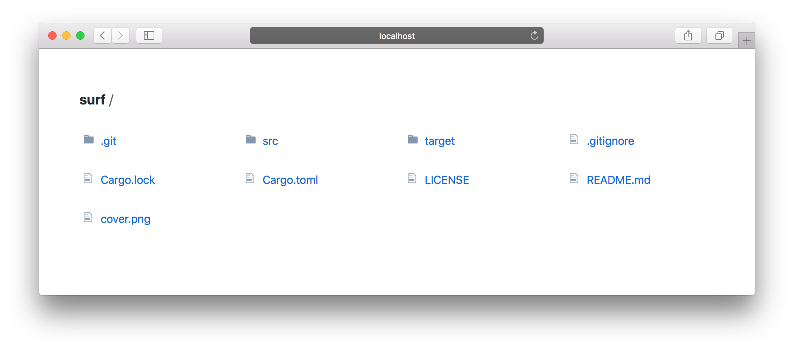

# Surf

[](https://travis-ci.org/weihanglo/surf) [](https://ci.appveyor.com/project/weihanglo/surf) [](https://deps.rs/repo/github/weihanglo/surf) [](https://github.com/weihanglo/surf/blob/master/LICENSE) [](https://github.com/weihanglo/surf)

[Surf][surf] is a simple-to-use command-line tool serving static files for you.



[surf]: https://github.com/weihanglo/surf

## Features

- Directory listing
- Partial responses (range requests)
- Conditional requests
- Cross-origin resource sharing
- Fast switch between sub directories

## Installation

### Automatic

#### Cargo

If you are a Rust programmer, you can install surf directly from GitHub via [Cargo][cargo].

```bash
$ cargo install --git https://github.com/weihanglo/surf
```

[cargo]: https://doc.rust-lang.org/cargo/

### Manual

#### Prebuilt binaries

Currently unavailable.

#### Build from source

Surf is written in Rust. You need to [install Rust][install-rust] in order to compile it.

```bash
$ git clone https://github.com/weihanglo/surf.git
$ cd surf
$ cargo build --release
$ ./target/release/surf --version
0.1.0
```

[install-rust]: https://www.rust-lang.org/install.html

## Usage

The simplest way to start serving files is to run this command:

```bash
surf [FLAGS] [OPTIONS] [path]
```

The command above will start serving your current working directory on `127.0.0.1:8888` by default.

If you want to serve another directory, pass `[path]` positional argument in with either absolute or relaitve path.

```bash
surf /usr/local

# Serve files under `/usr/local` directory.
```

### Flags and Options

Surf is aim to be simple but configurable. Here is a list of available options:

| Option         | Default Value             |
| :------------- | ------------------------  |
| Base directory | current working directory |
| Port           | 8888                      |
| Address        | 127.0.0.1                 |
| CORS           | `false`                   |
| Caching        | 0 second                  |

For more infomation, run following command:

```bash
surf --help
```

## Contributing

Contributions are highly appreciated! Feel free to open issues or send pull requests directly.

## Credits

Surf was originally inspired by another static serving tool [serve][serve], and its directory-listing UI is mainly borrowed from [GitHub][github].

Surf is built on the top of awesome Rust community. Thanks for all Rust and crates contributors.

[serve]: https://github.com/zeit/serve
[github]: https://github.com/

## License

[The MIT License (MIT)](LICENSE)

Copyright © 2018 Weihang Lo
